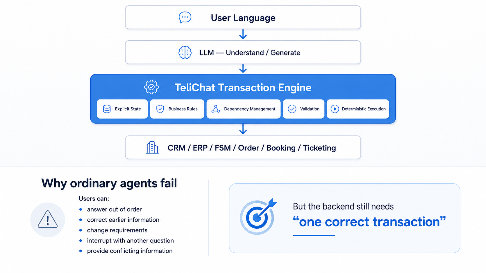

# TeliChat

> **Deterministic Conversational Transaction Engine for reliable enterprise AI agents**

[English](README.md) | [简体中文](README.zh-CN.md)

LLMs are excellent at understanding and generating natural language.  
But enterprise transactions need more than plausible language — they need **explicit state, validated business rules, controlled execution, and one correct result**.

**TeliChat separates natural-language intelligence from deterministic business execution.**



## Conversation Is Non-Deterministic. Business Transactions Cannot Be.

Real users do not follow a clean workflow. They may:

- answer questions out of order
- provide incomplete information
- correct something they said earlier
- change requirements midway
- interrupt with another topic
- provide conflicting information

A conversational system must remain flexible enough to handle this naturally.

But the backend still needs:

> **one validated, internally consistent transaction**

That is the problem TeliChat is designed to solve.

## Core Principle

TeliChat uses the LLM where probabilistic intelligence is useful, while keeping critical business behavior explicit and controllable.

| Layer | Responsibility |
|---|---|
| **LLM** | Natural-language understanding, information extraction, intent recognition, response generation |
| **Explicit State** | Structured conversation and transaction state |
| **Business Rules** | Deterministic conditions, constraints, permissions, and decisions |
| **Dependency Management** | Re-evaluate dependent data when upstream information changes |
| **Validation** | Verify information before business actions are executed |
| **Transaction Execution** | Controlled calls to CRM, ERP, FSM, order, booking, ticketing, and other backend systems |

The goal is simple:

**Natural conversation on the outside. Deterministic execution on the inside.**

## How TeliChat Works

TeliChat is code-first and white-box. Its core building blocks include:

### ChatTree

Expresses deterministic conversational flow as an explicit tree / DAG rather than hiding control logic inside a large prompt.

### InfoItem

Represents structured conversational state — the business information collected, updated, validated, and used during a transaction.

### Python Code

Handles business rules, conditional logic, dependency updates, API calls, backend integration, and other deterministic operations.

### LLM

Handles the parts that benefit from language intelligence: understanding user input, extracting information, recognizing intent, and generating natural responses.

This separation makes complex conversational behavior easier to **debug, test, trace, and evolve**.

## Why Not Just Workflow or ReAct?

The comparison below is intentionally simplified, but it illustrates the design goal.

| Capability | Traditional Workflow | Typical ReAct Agent | TeliChat |
|---|:---:|:---:|:---:|
| Natural free-form conversation | Limited | Strong | Strong |
| Explicit conversation state | Strong | Often implicit | Strong |
| Deterministic business logic | Strong | Often model-driven | Strong |
| Handle out-of-order answers | Difficult | Flexible but implicit | Built into state handling |
| Handle corrections to earlier data | Manual branching | Possible but hard to reason about | Explicit update + dependency handling |
| Backend transaction safety | Strong | Requires extra guardrails | Explicit validation + controlled execution |
| Regression testing | Strong | Harder for open-ended behavior | Designed for testable flows |
| Debuggability / execution trace | Strong | Often trace-heavy but implicit | White-box state + execution trace |

TeliChat aims to combine the **flexibility of LLM interaction** with the **control of workflow systems**.

## Example: A Field-Service Transaction

Consider a user starting a service request:

```text
User: My machine A1023 stopped with error E37.
```

The conversation state may become:

```text
asset_id = A1023
error_code = E37
warranty_status = valid
```

Then the user corrects the asset:

```text
User: Sorry, it's A1203.
```

The system should not merely replace one string. Data derived from the previous asset may now be invalid.

Conceptually:

```text
asset_id = A1203

invalidate:
  warranty_status
  service_history
  available_service_slots

re-query backend...
```

The user may continue naturally:

```text
Can someone come tomorrow morning?

By the way, is it still under warranty?

Actually, make that Friday afternoon.
```

TeliChat keeps the conversation natural while maintaining explicit transaction state and re-validating dependencies before execution.

A final backend action should happen only after the transaction is internally consistent, for example:

```text
asset_id       = A1203
error_code     = E37
warranty       = valid
visit_date     = Friday
visit_slot     = afternoon
```

**The conversation can be messy. The submitted transaction cannot be.**

## Key Capabilities

- Complex multi-turn information collection
- Out-of-order input handling
- Correction and state update across turns
- Dependency invalidation and re-evaluation
- Topic interruption and return
- Business-rule validation
- RAG / knowledge-base integration
- Dynamic backend queries
- REST API and enterprise-system integration
- Human handoff with preserved context
- Multi-language conversational interaction
- Conversation testing
- Execution tracing and IDE-oriented debugging

## Repository Contents

This repository contains public examples for TeliChat:

```text
examples/
├── api/    # API integration examples
├── en/     # English examples
└── cn/     # Chinese examples
```

The core TeliChat engine itself is not included in this repository.

## Quick Start & Documentation

- **Quick Start:** https://telichat.io/docs/next/quick_start/
- **Documentation:** https://telichat.io/docs/next/overview/
- **API:** https://telichat.io/docs/next/api/
- **Website:** https://telichat.io/

Chinese documentation:

- **快速开始:** https://telichat.io/zh-Hans/docs/next/quick_start/
- **文档:** https://telichat.io/zh-Hans/docs/next/overview/
- **API:** https://telichat.io/zh-Hans/docs/next/api/

## Repository Scope

This repository is intended to provide public examples, integration references, and technical demonstrations of TeliChat.

The core product source code is not open sourced.

Example code in this repository is licensed under the MIT License.

---

**TeliChat — Natural conversation. Deterministic business execution.**
