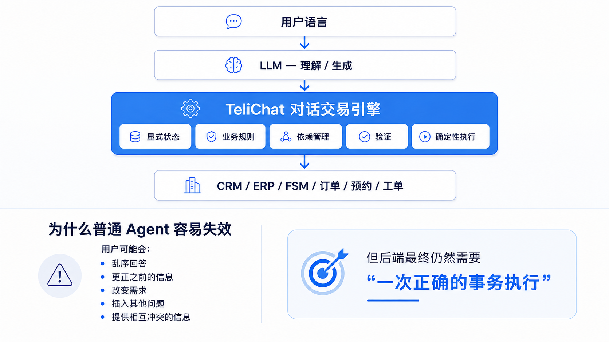

# TeliChat

> **面向可靠企业级 AI Agent 的确定性对话交易引擎**

[English](README.md) | [简体中文](README.zh-CN.md)

LLM 擅长理解和生成自然语言。  
但企业业务事务仅有“听起来合理”是不够的，它还需要 **显式状态、可验证的业务规则、受控执行，以及一个正确的最终结果**。

**TeliChat 将自然语言智能与确定性的业务执行分离。**



## 对话可以是不确定的，业务事务不能

真实用户不会严格按照预设流程说话。他们可能：

- 乱序回答问题
- 只提供部分信息
- 更正之前说过的内容
- 在过程中改变需求
- 插入另一个话题
- 提供相互冲突的信息

对话系统必须足够灵活，才能自然地处理这些情况。

但后端最终仍然需要：

> **一次经过验证、内部一致的正确事务执行**

这正是 TeliChat 要解决的问题。

## 核心原则

TeliChat 让 LLM 负责适合概率式智能的工作，同时把关键业务行为保持为显式、可控的状态与代码。

| 层次 | 职责 |
|---|---|
| **LLM** | 自然语言理解、信息抽取、意图识别、自然语言生成 |
| **显式状态** | 结构化保存对话状态与事务状态 |
| **业务规则** | 用确定性的条件、约束、权限和判断控制业务逻辑 |
| **依赖管理** | 上游信息变化后，对依赖数据进行失效与重新计算 |
| **验证** | 在执行真实业务动作之前验证信息 |
| **事务执行** | 受控调用 CRM、ERP、FSM、订单、预约、工单等后台系统 |

目标很简单：

**外部保持自然对话，内部保持确定性执行。**

## TeliChat 如何工作

TeliChat 是一个代码优先、白盒化的对话 Agent 框架，其核心组成包括：

### ChatTree（对话树）

通过显式的树 / DAG 表达确定性的对话流转，而不是把控制逻辑隐藏在一个大型 Prompt 中。

### InfoItem（信息项）

表达结构化的对话状态，也就是在业务事务过程中持续收集、修改、验证和使用的信息。

### Python Code

负责业务规则、条件判断、依赖更新、API 调用、后台集成以及其他需要确定性执行的逻辑。

### LLM

负责真正需要语言智能的部分：理解用户输入、抽取信息、识别意图以及生成自然语言回复。

这种分工使复杂对话行为更容易 **调试、测试、跟踪和持续演进**。

## 为什么不只是 Workflow 或 ReAct？

下面的表格是一个简化对比，用于说明 TeliChat 的设计目标。

| 能力 | 传统 Workflow | 典型 ReAct Agent | TeliChat |
|---|:---:|:---:|:---:|
| 自然、自由的语言交互 | 有限 | 强 | 强 |
| 显式对话状态 | 强 | 通常较隐式 | 强 |
| 确定性业务逻辑 | 强 | 经常由模型决策 | 强 |
| 处理乱序回答 | 困难 | 灵活但状态隐式 | 由状态机制直接处理 |
| 更正之前的信息 | 需要大量分支 | 可以处理但难以推理 | 显式更新 + 依赖管理 |
| 后台事务安全性 | 强 | 需要额外 Guardrail | 显式验证 + 受控执行 |
| 回归测试 | 强 | 开放式行为较难测试 | 面向可测试对话流设计 |
| 调试 / 执行跟踪 | 强 | Trace 多但状态常隐式 | 白盒状态 + 执行踪迹 |

TeliChat 希望同时获得：

> **LLM 对话的灵活性 + Workflow 系统的可控性**

## 示例：制造业现场服务事务

例如用户发起售后服务：

```text
用户：我的 A1023 设备停机了，报错 E37。
```

系统中的状态可能变成：

```text
asset_id = A1023
error_code = E37
warranty_status = valid
```

随后用户进行更正：

```text
用户：抱歉，设备编号其实是 A1203。
```

这时系统不应该仅仅替换一个字符串，因为基于旧设备查询得到的数据可能已经全部失效。

概念上应该发生：

```text
asset_id = A1203

invalidate:
  warranty_status
  service_history
  available_service_slots

重新查询后台系统...
```

用户还可能继续以非常自然的方式交流：

```text
明天上午能安排人来吗？

顺便问一下，还在保修期内吗？

算了，时间改成周五下午。
```

TeliChat 在保持自然交互的同时，持续维护显式事务状态，并在真正执行事务前重新验证所有依赖关系。

最终提交给后台系统的内容必须内部一致，例如：

```text
asset_id       = A1203
error_code     = E37
warranty       = valid
visit_date     = 周五
visit_slot     = 下午
```

**对话可以很乱，但提交给后台的事务不能乱。**

## 核心能力

- 复杂多轮信息收集
- 乱序输入处理
- 跨轮次的信息更正与状态更新
- 依赖失效与重新计算
- 话题插入、切换与返回
- 业务规则验证
- RAG / 知识库集成
- 对话过程中的动态后台查询
- REST API 与企业后台系统集成
- 保留上下文的人工接管
- 多语言对话
- 对话测试
- 执行踪迹与 IDE 调试

## 仓库内容

本仓库包含 TeliChat 的公开示例：

```text
examples/
├── api/    # API 集成示例
├── en/     # 英文示例
└── cn/     # 中文示例
```

TeliChat 核心引擎本身不包含在本仓库中。

## 快速开始与文档

中文：

- **快速开始:** https://telichat.io/zh-Hans/docs/next/quick_start/
- **文档:** https://telichat.io/zh-Hans/docs/next/overview/
- **API:** https://telichat.io/zh-Hans/docs/next/api/
- **官网:** https://telichat.io/zh-Hans/

English:

- **Quick Start:** https://telichat.io/docs/next/quick_start/
- **Documentation:** https://telichat.io/docs/next/overview/
- **API:** https://telichat.io/docs/next/api/

## 仓库范围

本仓库用于提供 TeliChat 的公开示例、集成参考和技术演示。

TeliChat 产品核心源代码不开源。

本仓库中的示例代码采用 MIT License。

---

**TeliChat — 自然对话，确定性业务执行。**
